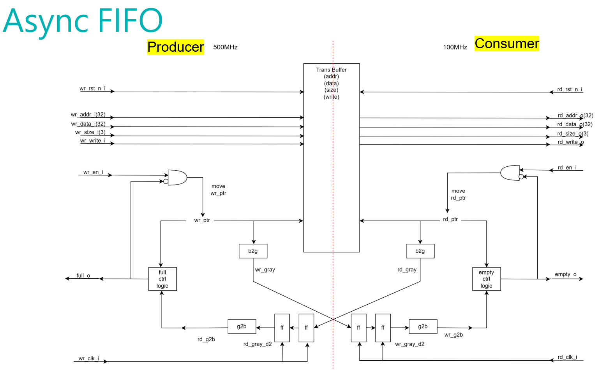

# Async-FIFO-Design-Notes

## 📌 Summary
> **This project designs and validates an asynchronous FIFO to bridge a high-speed AHB bus (500 MHz) and a low-speed QSPI PSRAM controller (104 MHz), enabling safe clock domain crossing in a RISC-V SoC.**

## Motivation
While developing a RISC-V SoC, I encountered a clock domain mismatch: the CPU and AHB bus operate at 500 MHz, but the external QSPI PSRAM can only operate up to 104 MHz. To safely connect the two domains, I designed an **asynchronous FIFO (async FIFO)** between the AHB2QSPI bridge and the PSRAM controller.
- **Write side (Producer)**: Driven by AHB bus @ 500 MHz
- **Read side (Consumer)**: Driven by QSPI controller @ 104 MHz

The FIFO safely buffers AHB transactions and transfers them to the slower domain while handling metastability, full/empty detection, and pointer synchronization.

## System Diagram

This FIFO is placed between the AHB2QSPI interface logic and the QSPI memory controller. It transmits 4 fields per transaction:
- `addr_i[31:0]`
- `data_i[31:0]`
- `size_i[2:0]`
- `write_i` (control)

## Design Features

| Feature                        | Description                                                             |
|-------------------------------|-------------------------------------------------------------------------|
| Dual-clock operation        | Independent clocks for write and read sides                            |
| Gray code synchronization   | Prevents metastability in pointer exchange                             |
| Multi-field transaction     | Each FIFO slot stores `{addr, data, size, write}`                      |
| Control logic               | Full and empty logic based on cross-domain pointer comparison          |
| Simulation ready            | Testbench supports waveform dump and corner-case testing               |

## Repo Structure
- Async-FIFO-Design-Notes/
  - README.md
- doc/
  - design-notes.md # FIFO operation, pointer sync logic, future work
- src/
  - async_fifo.v # RTL implementation
  - tb_async_fifo.v # Testbench with transaction sequences
- run/
  - Makefile

## Next Steps
- Extend testbench with formal assertions
- Integrate this FIFO into the actual AHB2QSPI bridge
- Evaluate write-thru vs buffered performance under wait states
